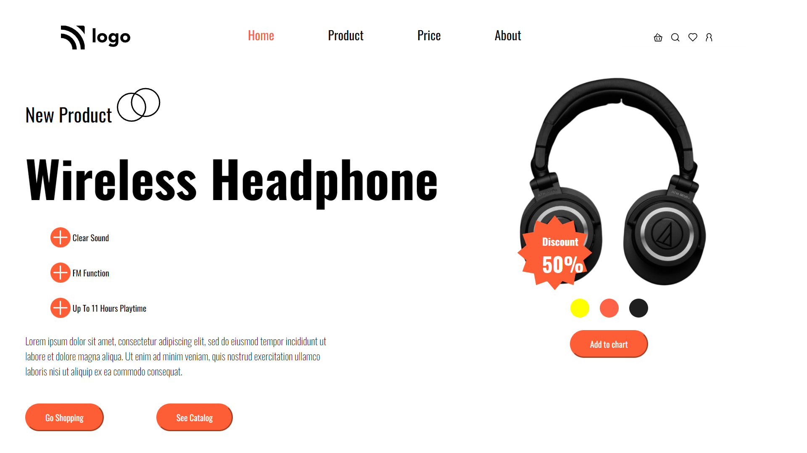

<!-- Headings -->
# Live-Class-Project-7(Ineuron)
## **Table of content**
- project description
- project screenshot
- Built using
- Things I learnt

## **Project Description**
>This Project was given to me during my fullstack Javascript developer course at [Ineuron](https://ineuron.ai/courses). In this project, one design was given to me and I was required to convert it to a web page using HTML and CSS and have to make it responsive as well.

## **Project ScreenShot**
 
 

 
 

## **Built using**

- HTML
- CSS

## **Things I learnt**
>I became more confident in writing HTML and CSS. In this project, I also used position property of css.To make this project responsive I used media query.